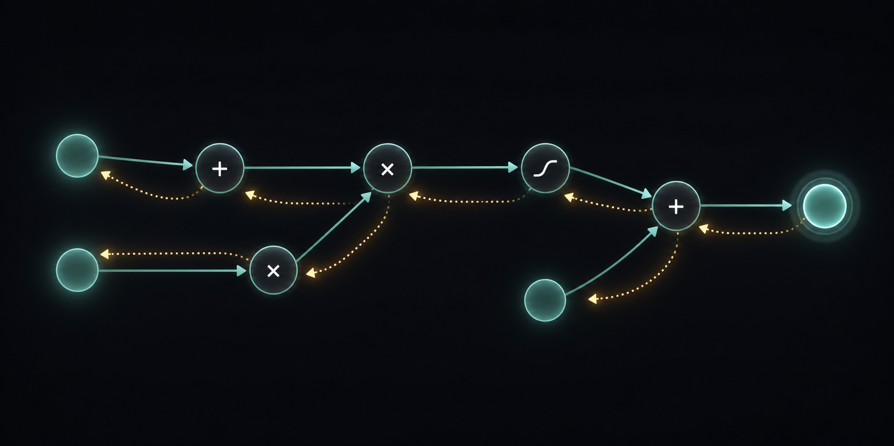
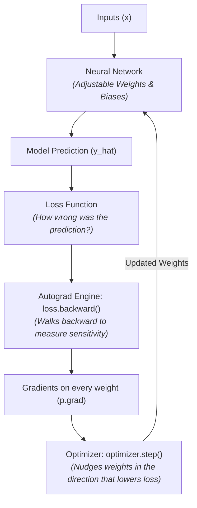
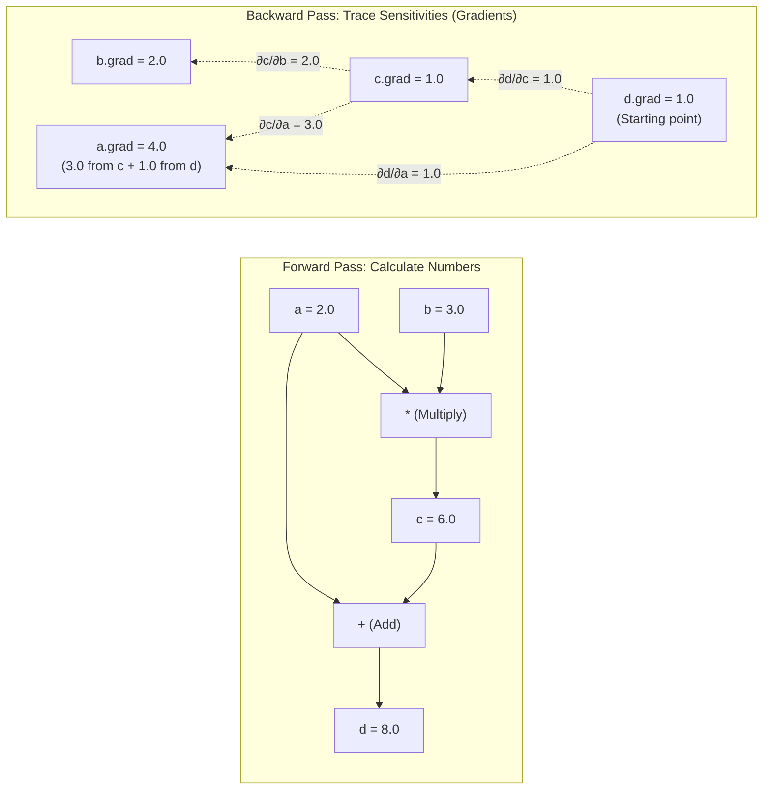
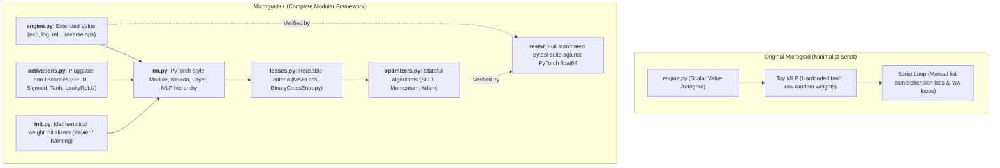

# Micrograd++

A lightweight, scalar-valued automatic differentiation (autograd) engine and modular deep learning framework, written from scratch in pure Python.



---

## What is Micrograd? (In Simple Terms)

Imagine you are baking a cake, but when it comes out of the oven, it tastes far too sweet. You want to fix the recipe, so you ask yourself:
> *"Which ingredient caused this, and by how much should I change it?"*

If you know the exact recipe, you can trace backward: *"I added 3 cups of sugar and 1 teaspoon of vanilla. The sugar is the main culprit, so reducing sugar by 1 cup will fix the sweetness."*

### How Neural Networks Learn
A neural network is just a giant mathematical recipe. It takes inputs (like an image of a handwritten digit), processes them through thousands of tiny adjustable dials called **parameters** (weights and biases), and produces a prediction (e.g., *"This is an 8"*).

1. If the prediction is wrong, we calculate an error score called the **Loss**.
2. To make the model smarter, we need to know: **If we nudge dial #42 by a tiny bit, does the error go up or down?**
3. That sensitivity measurement is called the **gradient**.



**Micrograd is the engine behind step 5.** It silently watches every math operation as it happens, builds a roadmap of the calculations, and then walks backward to calculate the exact gradient for every single parameter.

---

## How Does the Math Work? (The Computational Graph)

Whenever you do math with Micrograd's `Value` objects, the engine builds a **computational graph**.

Consider this simple calculation:
$$d = (a \times b) + a \quad \text{where } a = 2.0, \; b = 3.0$$



### In Code:
```python
from micrograd.engine import Value

a = Value(2.0)
b = Value(3.0)

c = a * b       # c = 6.0
d = c + a       # d = 8.0

# Calculate all derivatives automatically!
d.backward()

print(f"d.data = {d.data}")  # 8.0
print(f"a.grad = {a.grad}")  # 4.0  (because ∂d/∂a = b + 1 = 3 + 1)
print(f"b.grad = {b.grad}")  # 2.0  (because ∂d/∂b = a = 2)
```

---

## Micrograd vs. Micrograd++

Andrej Karpathy's original **micrograd** proved that backpropagation can be written in ~100 lines of Python. However, it was designed as a minimal educational script rather than a structured framework.

**Micrograd++** takes that core autograd engine and builds a **modular, PyTorch-style deep learning library** around it:



### Key Differences:
| Feature | Original Micrograd | Micrograd++ |
|---|---|---|
| **Architecture** | Single notebook / script style | Modular library (`engine`, `nn`, `losses`, `optimizers`, `init`) |
| **Activations** | `tanh` hardcoded in the neuron | Pluggable: `ReLU`, `Sigmoid`, `LeakyReLU`, `tanh` |
| **Loss Functions** | Ad-hoc manual math inside loop | Callable objects: `MSELoss()`, `BinaryCrossEntropy()` |
| **Optimizers** | Loose `for p in params: p.data -= lr * p.grad` | Dedicated classes: `SGD`, `SGD with Momentum`, `Adam` |
| **Initialization** | Raw uniform random `[-1, 1]` | `Xavier` (for Tanh) and `Kaiming` (for ReLU) |
| **Verification** | Print statements in notebook cells | Automated `pytest` suite testing exact parity with PyTorch |

---

## Training a Neural Network

Building and training a Multi-Layer Perceptron (MLP) follows the standard PyTorch workflow:

```python
from micrograd.engine import Value
from micrograd.nn import MLP
from micrograd.losses import MSELoss
from micrograd.optimizers import SGD

# 1. Define a model: 2 inputs -> two hidden layers of 4 -> 1 output
model = MLP(2, [4, 4, 1])

# 2. Setup loss criterion and optimizer
criterion = MSELoss()
optimizer = SGD(model.parameters(), lr=0.05, momentum=0.9)

# 3. Toy dataset (XOR problem)
xs = [
    [Value(0.0), Value(0.0)],
    [Value(0.0), Value(1.0)],
    [Value(1.0), Value(0.0)],
    [Value(1.0), Value(1.0)],
]
ys = [Value(0.0), Value(1.0), Value(1.0), Value(0.0)]

# 4. Training loop
for epoch in range(100):
    # Forward pass
    ypred = [model(x) for x in xs]
    loss = criterion(ypred, ys)

    # Backward pass & optimization
    optimizer.zero_grad()
    loss.backward()
    optimizer.step()

    if epoch % 20 == 0:
        print(f"Epoch {epoch:3d} | Loss: {loss.data:.6f}")
```

---

## Running the Test Suite

Every operation, forward calculation, activation, and gradient update is tested for exact numerical parity against PyTorch using double-precision (`torch.float64`):

```bash
# Run all unit tests
pytest tests/ -v
```

---

## Project Structure

```text
Micrograd-Plus-Plus/
├── micrograd/
│   ├── __init__.py
│   ├── engine.py          # Core Value class & scalar autograd engine
│   ├── activations.py     # Activation functions (ReLU, Sigmoid, etc.)
│   ├── init.py            # Weight initialization (Xavier, Kaiming)
│   ├── nn.py              # Neural network modules (Neuron, Layer, MLP)
│   ├── losses.py          # Reusable loss functions (MSELoss, etc.)
│   └── optimizers.py      # Optimization algorithms (SGD, Momentum, Adam)
├── tests/
│   ├── test_engine.py     # Autograd math & gradient checks vs PyTorch
│   ├── test_loss.py       # Loss function verification vs PyTorch
│   └── test_optimizer.py  # Optimizer updates & multi-step parity vs PyTorch
├── examples/              # Runnable benchmarks (XOR, 2D moons, circles)
├── viz/                   # Graphviz computational graph visualizer
└── README.md
```

---

## Acknowledgments & Inspiration

- Andrej Karpathy's video lecture: [Neural Networks: Zero to Hero — Micrograd](https://karpathy.ai/zero-to-hero.html)
- The original [micrograd repository](https://github.com/karpathy/micrograd)
